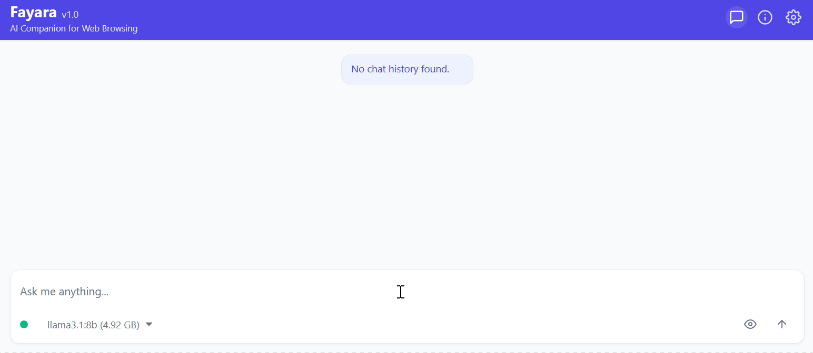

# Fayara: Your Local AI Powerhouse for Browsers

[](https://mdfahimanjum.github.io/fayara.github.io/)

Experience the future of browsing with AI that runs directly on your machine. Fayara empowers you to chat, summarize, proofread, and automate tasks with enhanced privacy and full control over your data.

**➡️ [Download Fayara for Firefox (v1.0.0)](https://github.com/MDFahimAnjum/fayara/releases/download/v1.0.0/fayara-firefox-1.0.0.xpi)**

## ✨ Features at a Glance

<table>
  <tr>
    <td align="center">
      <strong>Chat with AI</strong><br>
      
    </td>
    <td align="center">
      <strong>Chat with Websites</strong><br>
      
    </td>
    <td align="center">
      <strong>Chat with Local PDFs</strong><br>
      
    </td>
  </tr>
  <tr>
    <td align="center">
      <strong>Autocomplete Text</strong><br>
      
    </td>
    <td align="center" colspan="2">
      <strong>Proofread Selected Text</strong><br>
      
    </td>
  </tr>
</table>

## 🚀 Key Features in Detail

### 1. Chat with AI
Ask questions, get answers, and have natural conversations with powerful AI models right in your browser.
*   **Smart Search:** Ask complex queries and get precise answers.
*   **Coding Help:** Get programming assistance and code explanations.
*   **Creative Writing:** Generate ideas, outlines, and content.


### 2. Chat with Websites
Interact with web page content directly. Ask questions about articles, research papers, or documentation.
*   **Content Summaries:** Get the key points of any webpage.
*   **Detailed Analysis:** Ask specific questions about the content.
*   **Language Translation:** Understand content in different languages.


### 3. Chat with Local PDFs
Upload and interact with your PDF files without sending them to external servers.
*   **Document Q&A:** Ask questions about your PDF content.
*   **Extract Information:** Pull out specific data and insights.
*   **Document Comparison:** Compare information across multiple PDFs (feature planned).


### 4. Autocomplete Text
Write faster with AI-powered text completion for emails, social media posts, or any text field.
*   **Smart Suggestions:** Get context-aware text completions.
*   **Style Matching:** AI adapts to your writing style.
*   **Multiple Languages:** Works across various languages.


### 5. Proofread Selected Text
Improve your writing with AI-powered grammar checking, rephrasing, and style suggestions.
*   **Grammar Correction:** Fix errors and typos instantly.
*   **Style Enhancement:** Get suggestions for clearer writing.
*   **Tone Adjustment:** Adapt your text for different audiences.


## 🌟 Why Choose Fayara?

*   **🧠 Local AI Processing:** Runs AI models directly on your computer via Ollama for enhanced speed and offline capabilities.
*   **🛡️ Privacy First:** Your data stays on your device. No need to send sensitive information to third-party clouds.
*   **🔧 Your Models, Your Control:** Choose and manage the AI models you want to use through Ollama's extensive library.
*   **🔌 Browser Extension:** Currently available for Firefox, with seamless integration into your browsing experience for maximum productivity.

## 🛠️ Simple Setup, Powerful Results

1.  **⚙️ Install Ollama:**
    Fayara uses Ollama to run AI models locally. Download and install it first.


    <a href="https://ollama.com/download" target="_blank" rel="noopener noreferrer">
        
    </a>

2.  **💾 Download AI Models:**
    Pull your desired models via the command line. For example:
    ```bash
    ollama pull llama3
    ollama pull nomic-embed-text
    ```
    *(Fayara typically requires a general-purpose model like `llama3` for chat and an embedding model like `nomic-embed-text` for document interactions.)*

3.  **🚀 Install Fayara:**
    Add the Fayara extension to your Firefox browser and start exploring!

    
    <a href="https://github.com/MDFahimAnjum/fayara/releases/download/v1.0.0/fayara-firefox-1.0.0.xpi" rel="noopener noreferrer">
      
    </a>

## 📥 Get Fayara Now!

Ready to power up your browsing? Join the growing community of users who are taking control of their AI experience with Fayara.

**Download Fayara for Firefox - It's Free!**

## 🔗 Useful Links

*   [**🌐 Website**](https://mdfahimanjum.github.io/fayara/)
*   [**📖 Onboarding Guide**](https://MDFahimAnjum.github.io/fayara.github.io/onboarding.html)
*   [**❓ Help Page**](https://mdfahimanjum.github.io/fayara.github.io/help.html)
*   [**📄 Privacy Policy**](https://mdfahimanjum.github.io/fayara.github.io/privacyPolicy.html)

## 🙏 Acknowledgements

*   Fayara relies on the powerful **Ollama** platform to run local large language models.
